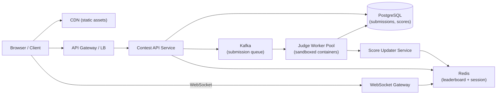

# System Design: Competitive Coding Challenge Platform

## 1. Problem Statement

Engineers need a platform to host timed coding challenges for up to 10,000 simultaneous participants. Participants submit code solutions, get real-time judging feedback, and can see a live leaderboard showing the top 10 scores and their own rank — incentivizing competition and progress tracking throughout the event.

---

## 2. Requirements

### Functional Requirements
- Users register and join a challenge session
- Problems displayed with constraints, examples, test cases hidden
- Code submission → judge against hidden test cases → return pass/fail + score
- Leaderboard: top 10 globally + current user's rank/score, updated in near real-time
- Multiple language support (Python, Java, Go, C++)

### Non-Functional Requirements

| NFR | Target |
|-----|--------|
| Scale | 10K concurrent users, ~500 submissions/min at peak |
| Latency | Submission result < 5s p95; leaderboard refresh < 1s |
| Availability | 99.9% during contest window |
| Consistency | Leaderboard: eventual (1–2s lag acceptable); scores: strong |
| Durability | No submission loss — all runs persisted |
| Security | Code sandboxing — no host access, CPU/memory limits enforced |

---

## 3. Capacity Estimation

- **Submissions:** 10K users × ~3 submissions/min avg = ~500 submissions/min → ~9 RPS sustained, ~30 RPS burst
- **Leaderboard reads:** 10K users polling every 2s = 5K RPS on leaderboard endpoint
- **Storage:** 500 submissions/min × 60 min × 10KB avg = ~300MB per contest (trivial)
- **Judge workers needed:** Each judge takes ~2s → 30 RPS burst needs ~60 concurrent judge slots
- **Cache hit rate:** Leaderboard top-10 cached — expected >99% hit rate; only invalidated on score change

---

## 4. High-Level Architecture



**Flow:**
1. User submits code → API writes submission to DB + publishes to Kafka
2. Judge Worker pulls from Kafka, runs code in isolated container, writes result to DB
3. Score Updater reads judge result, updates PostgreSQL score, recomputes Redis leaderboard
4. WebSocket Gateway pushes leaderboard delta to connected clients (or client polls every 2s)

---

## 5. Data Modeling

**`users`** — `id`, `username`, `email`
**`contests`** — `id`, `start_time`, `end_time`, `problem_ids[]`
**`problems`** — `id`, `title`, `description`, `test_cases` (stored separately, not exposed to client)
**`submissions`** — `id`, `user_id`, `problem_id`, `contest_id`, `code`, `language`, `status` (pending/running/accepted/wrong), `score`, `submitted_at`
**`contest_scores`** — `user_id`, `contest_id`, `total_score`, `last_accepted_at` ← the ranking source of truth

**Store choices:**
- PostgreSQL for all structured data — ACID guarantees needed for score writes
- Redis Sorted Set for leaderboard: key = `leaderboard:{contest_id}`, score = `total_score`, member = `user_id` — O(log N) updates, O(log N) rank lookup
- Blob store (S3) for submitted code archival (optional, saves DB space)

**Indexes:**
- `contest_scores(contest_id, total_score DESC)` — leaderboard queries
- `submissions(user_id, contest_id)` — user history

---

## 6. API Design

```
POST /contests/{id}/submissions
  Request: { problem_id, language, code }
  Response: { submission_id, status: "queued" }

GET /submissions/{id}
  Response: { status, score, test_results[], executed_at }

GET /contests/{id}/leaderboard
  Response: { top10: [{rank, username, score, last_accepted_at}], me: {rank, score} }

GET /contests/{id}/problems/{problem_id}
  Response: { title, description, examples, constraints }

WebSocket: ws://host/contests/{id}/live
  Server pushes: { type: "leaderboard_update", top10: [...], my_rank: N }
```

---

## 7. Scalability & NFR Mapping

| NFR | Decision |
|-----|----------|
| High availability | API + Judge workers stateless → horizontal scale behind LB; Redis + Postgres with replicas |
| Low latency leaderboard reads | Redis Sorted Set — `ZREVRANGE` top 10 = O(log N), `ZREVRANK` for user = O(log N); 5K RPS trivially handled |
| Submission durability | Kafka with replication factor 3; DB write before judge starts; submission never lost even if judge crashes |
| Judge isolation & security | Each submission runs in a fresh Docker container with: CPU limit (1 core), memory cap (256MB), no network, 5s wall clock timeout, read-only filesystem |
| Burst handling | Kafka decouples submission rate from judge capacity; queue absorbs burst, workers drain at their own pace |

---

## 8. Trade-off Analysis

**WebSocket push vs. client polling for leaderboard**
Chose WebSocket for real-time feel. Downside: 10K persistent connections need a dedicated gateway (sticky sessions or pub/sub fan-out via Redis Pub/Sub). Polling at 2s intervals would be simpler and nearly as good UX — viable fallback if WebSocket infra adds complexity.

**Redis Sorted Set vs. DB-computed leaderboard**
Redis wins for read throughput (5K RPS) — recomputing from DB on every request would be a full table scan. Downside: Redis is a cache; if it flushes, leaderboard must be rebuilt from `contest_scores`. That rebuild takes <1s for 10K users — acceptable recovery.

**Single Kafka topic vs. per-problem queues**
Single topic `contest-submissions` with partitioning by `contest_id`. Simpler ops. Per-problem queues would give finer backpressure control but add overhead — not worth it at this scale.

**Containerized judges vs. language-specific VMs**
Containers spin up in ~200ms and are destroyed after each run. VMs are safer but too slow. Containers with seccomp profiles + no-network are secure enough for a controlled event.

---

## 9. Gotchas & Failure Modes

**Judge worker starvation:** If a problem has a common O(N²) solution that hits the 5s timeout, 10K users hammering it fills the queue. Mitigate: per-user rate limiting (max 1 submission in-flight per user), queue depth alerting, and autoscale judge workers.

**Redis leaderboard drift:** Score Updater writes to PostgreSQL then updates Redis. If the Redis write fails, leaderboard is stale. Fix: write to DB first, then async-update Redis; add a reconciliation job that replays `contest_scores` into Redis every 30s as a safety net.

**Tie-breaking:** Two users with identical scores — who ranks higher? Must be `last_accepted_at` ascending (earlier is better). Redis Sorted Set uses score only; store composite score as `(total_score * 1e12) + (MAX_TIMESTAMP - last_accepted_at_unix)` to encode tie-breaking in the float.

**Code injection / sandbox escape:** Contestants submit malicious code (fork bombs, filesystem writes). Enforce: PID limit (max 50), read-only FS, no network namespace, drop all Linux capabilities. Test these limits before the contest — they're easy to misconfigure.

**Clock skew on submission timestamps:** If API servers have drifted clocks, `submitted_at` ordering breaks. Use `now()` from the DB, not the application server.

**Contest end race condition:** Submissions in-flight at `end_time` — do you accept them? Decide and enforce consistently: cutoff is Kafka enqueue time (recorded server-side), not when the judge finishes.

---

## 10. Out of Scope / Future Considerations

**Out of scope for v1:**
- Anti-cheat / plagiarism detection (code similarity across submissions)
- Partial scoring for multi-test-case problems
- Editorial / solution reveal post-contest
- Multi-region deployment (assumed single region)

**v2 additions:**
- Spectator mode with live code replay
- Per-problem sub-leaderboards
- Rating system (ELO-style) across contests
- Plagiarism detection using AST comparison
